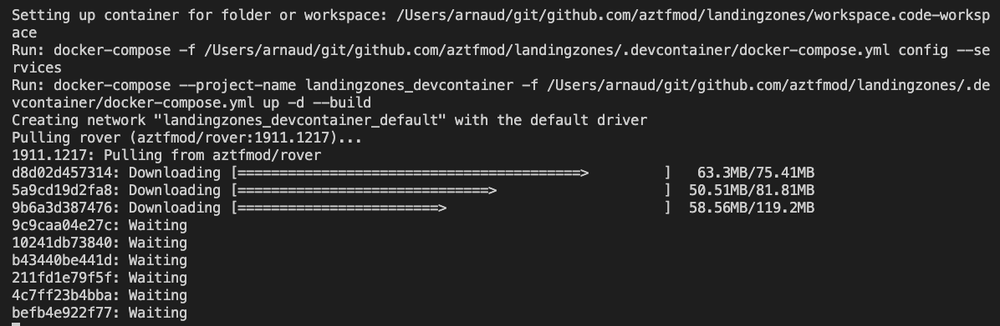

# Prerequisites

In order to start deploying your with CAF landing zones, you need an Azure subscription (Trial, MSDN, EA, etc.) and you need to install the following components on your machine:

- [Visual Studio Code](https://code.visualstudio.com/)
- [Docker Desktop](https://docs.docker.com/docker-for-windows/install/)
- [Git](https://git-scm.com/downloads)

You can install it easily on Windows and MacOS with the following software managers:

| MacOS  | Windows |
| ------ | ------- |
|```brew cask install visual-studio-code docker``` </br> ```brew install git ``` | Install Chocolatey (https://chocolatey.org/docs/installation) </br> ``` choco install git vscode docker-desktop ``` |

Once installed, open **Visual Studio Code** and install the "**Remote Development**" extension as follows: 


## Cloning the starter repository

The starter repository contains the basic configuration files and scenarios. It will allow you to compose your configuration files in the integrated environment. Clone this repository using the following command:

```bash
git clone https://github.com/Azure/caf-terraform-landingzones-starter.git

# Remove below 2 lines once this is merged to the starter branch
git pull
git checkout contoso-2109
```

## Open the repository in Visual Studio Code Dev Container

To open the repository you've just cloned in Visual Studio Code, click on the sign at the bottom left, and in the palette opening on the top of Visual Studio Code Window, select **"Open Folder in container"** or **"Reopen in container"**, and then select the location where you cloned the starter repository. 


This should take a while, in the meantime, feel free to click on Details to see the container being downloaded from the registry and being connected to your local environment:



After a while, your environment is ready, click the plus button on the right to open a new terminal in your environment. 


You should see this:


You are now in your Azure CAF Rover environment. [Rover](https://github.com/aztfmod/rover) is a docker container which provides you with all the tools and dependencies (and the right versions) needed to deploy the Azure CAF Terraform landing zones. 


## Clone the landing zones logic

Now we will need to get the landing zones logic in the same workspace, so let's clone the repository locally. In the terminal you just opened, run the following commands:

```bash
cd /tf/caf
git clone --branch 2108.0 https://github.com/Azure/caf-terraform-landingzones.git /tf/caf/landingzones
# Or refresh an existing clone
cd /tf/caf/landingzones
git checkout 2108.0
git pull # This command does not work - says you are not currently on a branch
```

**In future, the above steps may be automated using rover init or a setup command to pull the required repos.**


Now you can head back over to the [main README](./1-README.md) to proceed with the next steps. 

