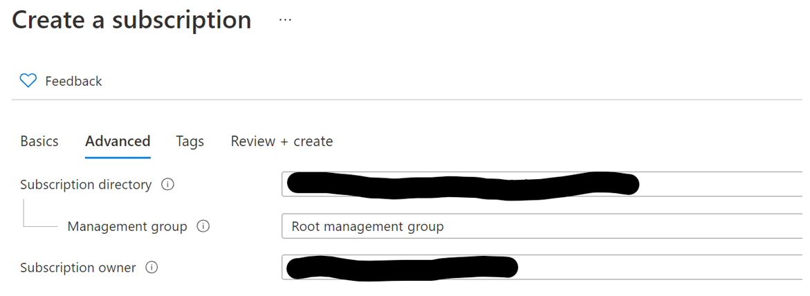

# Deploying Enterprise-Scale Landing Zones in Multi Subscription Mode

TODO: Find the page that describes what is deployed from L0-4

- Level 0 - launchpad, state for the different teams' landing zones
- Level 1 - policies, eslz
- Level 2 - core networking layer (virtual wan and virtual hubs) shared by teams
- level 3 - subscriptions and networking components (like virtual network) for projects and teams in the organization
- level 4 - infrastructure at the application layer, usually managed by individual team SREs 

We will first deploy the shared platform components from level 0 to 2. Once the platform has been deployed, the next scenario is where you will provision the Azure Subscriptions/Landing Zones for the individual teams and/or projects in the organization in level 3. We call this the Azure Vending Machine layer, as it is a process that takes in the configuration values for the project/team and generates the infrastructure as code to be deployed. 

In most cases, the organization's platform team would manage levels 0-3. Individual teams would make their own resource customizations and additions on level 4, based on their project or application requirements. 

## Creating your first Azure Subscription manually

Assuming an empty Azure AD tenant​, you will need to create an Azure subscription manually first to support the subscription delegation to the service principals. You will need Account Owner role on the Enterprise Agreement enrollment. Skip this step if you already have an Azure Subscription in your tenant. 

Go to the [Azure Portal](portal.azure.com) and login as the EA account owner. Create an Azure subscription from the portal.


Name the subscription and keep the EA owner as the subscription owner.



Wait for the subscription creation.


## Use Rover to authenticate with Azure

You must be authenticated with Azure first, run the following command in the terminal and follow the instructions. You will be prompted to login to your Azure account via the browser.

```bash
# Find tenant id or primary domain with the following instructions: https://docs.microsoft.com/en-us/partner-center/find-ids-and-domain-names
rover login -t <tenant id or primary domain> 
```

Rover will echo back the subscription selected by default for your environment. This should be your launchpad subscription (the one you just created). If this is not the right subscription, modify it using the following command:

```bash
az account list # Get a full list of subscriptions you own, to find the right subscription ID
az account set --subscription <subscription_GUID>
```


## Generate and Deploy the Platform Layers (Level 0-2)

You can find all the infrastructure configuration values for the platform in [the following folder](/orgs/contoso/multi-sub/platform). You will first need to customize some of the configuration for your own environment. 

Navigate to the [demo.caf.platform.yaml](/orgs/contoso/multi-sub/platform/demo.caf.platform.yaml) file and replace the following block in the yaml file with your own tenant and subscription details:
```yaml
primary_subscription_details:
      subscription_id: set_subscription_guid
      subscription_name: set_subscription_name
      tenant_id: set_tenant_id
```

You will also need to replace the values in the following block with your own tenant name and under `caf_platform_maintainers`, the emails of the users who you wish to grant permissions to manage the platform infrastructure layer. 
```yaml
platform_identity:
  # Set the Azure Active Directory tenant name. Do not include the .onmicrosoft.com
  tenant_name: change_tenant_name
  azuread_identity_mode: service_principal
  caf_platform_maintainers:
    - change_email@demo.com
```

Look through the yaml file for other parameters you need to replace. 

Once you are done, run the following commands to generate the CAF configurations for the platform landing zones:

```bash
cd /tf/caf/starter/templates/platform

rover ignite \
  --playbook /tf/caf/starter/templates/platform/ansible.yaml \
  -e base_templates_folder=/tf/caf/starter/templates \
  -e config_folder=/tf/caf/orgs/contoso/multi-sub/platform \
  -e config_folder_asvm=/tf/caf/orgs/contoso/multi-sub/asvm \
  -e scenario=demo \
  -e boostrap_launchpad=false \
  -e deploy_subscriptions=false
```

Running the above `rover ignite` command uses the values in your configuration yaml files to generate the CAF IaC for the platform landing zones, by populating the templates with your specified configuration values. You can find the platform templates at [templates/platform](/templates/platform).

TODO: Is there documentation for rover ignite command which we can link?

**Why separate out the configuration values?**
- Reason 1
- Reason 2

Once the command has run, your generated platform configuration files will be found [here](/configuration/contoso/demo/multi-sub/platform). You can execute the steps in the [level 0/launchpad readme](/configuration/contoso/demo/multi-sub/platform/level0/launchpad/readme.md) as the starting point to begin deploying the CAF launchpad.

### Updating the platform configurations

Note that each time you make modifications to the platform configurations or templates, you will need to re-run the `rover ignite` command to regenerate the CAF config files with the latest values.


##  Generate and Deploy the Azure Subscription Vending Machine Layer (Level 3)
Once you have deployed all the platform level components, we will now deploy the ASVM level 3. 

If you open the [ASVM configs folder](/configuration/contoso/demo/multi-sub/asvm), you will notice that there have been 3 example projects created. Each of these folders represent a "landing zone", or a subscription and set of base resources (like virtual networks, keyvaults, etc.) for an individual team or project. Each folder contains its own set of resource and subscription configuration files, and `rover ignite` will generate the IaC for each of these projects to be deployed. 

Run the following to generate the CAF configurations for the ASVM layer:

```bash
cd /tf/caf/starter/templates/asvm

rover ignite \
  --playbook /tf/caf/starter/templates/asvm/ansible.yaml \
  -e base_templates_folder=/tf/caf/starter/templates \
  -e config_folder=/tf/caf/orgs/contoso/multi-sub/asvm \
  -e platform_config_folder=/tf/caf/orgs/contoso/multi-sub/platform \
  -e scenario=demo \
  -e boostrap_launchpad=false \
  -e deploy_subscriptions=false
```

Once the command has run, your generated ASVM CAF configs will be found [here](/configuration/contoso/demo/multi-sub/asvm). You can execute the [steps in the project 1 folder](/configuration/contoso/demo/multi-sub/asvm/project1/subscription/readme.md) as the starting point to begin deploying the subscription.


## Creating a new Landing Zone with the ASVM

Now that you have deployed the example project landing zones, let's [generate and deploy a new landing zone](./3.1-CreateASVMLandingZone.md) with the ASVM. 

