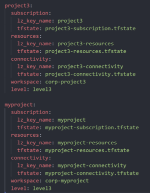

# Creating a landing zone with the ASVM

Let's say a team would like to set up Infrastructure as Code for their new project or application. We will need to create a landing zone - a subscription with a set of baseline resources (like virtual networks or key vaults), where they can begin to deploy the infrastructure to host their applications (like Web Apps or Virtual Machines).

### Clone one of the project folders and its contents

Below we cloned a folder and named it `myproject`. You can name the project however you want. 


### Adjust the name and the keys in the file as needed

Mostly replacing with your new project name. 


### Update the address space of the `virtual_network` configuration.

Ensure that your new project VNET's address space does not overlap with that of an existing project. 


### Update the tfstates.yaml

Add a block for your project in tfstates.yaml file. This yaml file is where you specify the name for your tfstate file, which will be stored in a blob container. 




### Run rover ignite for the platform again

This creates a storage container in the level3 and level4 storage accounts - this step will be removed in future releases. 

```bash
cd /tf/caf/starter/templates/platform

rover ignite \
  --playbook /tf/caf/starter/templates/platform/ansible.yaml \
  -e base_templates_folder=/tf/caf/starter/templates \
  -e config_folder=/tf/caf/orgs/contoso/multi-sub/platform \
  -e config_folder_asvm=/tf/caf/orgs/contoso/multi-sub/asvm \
  -e scenario=demo \
  -e boostrap_launchpad=false \
  -e deploy_subscriptions=false
```

### Run rover ignite for the asvm

This will generate the CAF config files again for the ASVM layer. Once this command finishes running, you should see the tfvars files generated for the new project you have created. 

```bash
cd /tf/caf/starter/templates/asvm

rover ignite \
  --playbook /tf/caf/starter/templates/asvm/ansible.yaml \
  -e base_templates_folder=/tf/caf/starter/templates \
  -e config_folder=/tf/caf/orgs/contoso/multi-sub/asvm \
  -e platform_config_folder=/tf/caf/orgs/contoso/multi-sub/platform \
  -e scenario=demo \
  -e boostrap_launchpad=false \
  -e deploy_subscriptions=false
```

### Re-execute the launchpad level0 (to create the storage containers)

You can find the command at the [Level 0/launchpad readme](/configuration/contoso/demo/multi-sub/platform/level0/launchpad/readme.md). Once the command runs, if you go into the storage blob viewer, you should be able to see your a container created with your project name. 

### Execute the command from the generated readmes

Execute the commands from the readmes in the subscriptions, resources and connectivity folders in your generated project folder. **Do it in the order of subscriptions, resources, then connectivity.**

### Execute the command from the solution accelerator readme (not available yet - in future releases)


As you scale out, your team would eventually need to build some automation or DevOps pipelines to automate the above process, based on a set of parameters passed in (a true vending machine). 